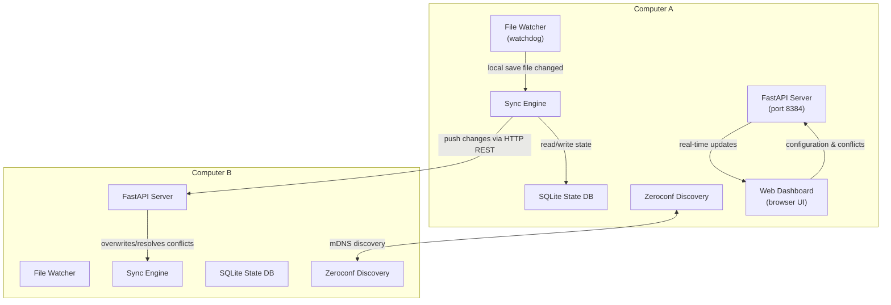

# GameSync — LAN Game Save Synchronizer

GameSync is a lightweight, cross-platform utility written in Python that automatically monitors, backups, and synchronizes your game save files between different PCs on your local area network (LAN). It features a modern dark-themed web dashboard for configuration, live monitoring, and resolving file conflicts.



## Features

- 🔌 **Zero-Config LAN Auto-Discovery:** Discovers other PCs running GameSync on your subnet automatically using mDNS (Zeroconf), with fallback options for manual IP:Port pairing.
- 📂 **Real-time FS Monitoring:** Utilizes platform-native OS events via `watchdog` to monitor saves, with a **2-second debounce** window to ensure files are fully written before sync starts.
- ⚙️ **Three-Way Conflict Management:** Uses hashes (SHA-256) and logical version numbers to detect modifications. If both computers edit a file offline, the save is staged side-by-side in a conflict state and can be resolved manually in the web UI.
- 🛡️ **Auto-Rotated Backups:** Retains the **last 3 versions** (configurable) of your save files prior to any overwrite operation, preventing data loss.
- 🔒 **PIN Authentication:** Securely locks the dashboard with a 4-digit code to block unauthorized local network access to your directories.
- 📁 **Server-Side Directory Browser:** Browse files and directories on the host system directly from the "Add Game" modal.
- ⚡ **Large File Warnings:** Emits real-time visual warning alerts if a game save file size exceeds the warning threshold.

---

## Quickstart

### 1. Installation
Clone or copy the project files to your PCs. Install the Python dependencies using `pip`:

```bash
pip install -r requirements.txt
```

### 2. Launch
Start the GameSync server on each machine:

```bash
python run.py
```

### 3. Setup Config
- Open your browser and navigate to `http://localhost:8384`.
- Retrieve your generated security PIN (or hostname settings) from the local configuration file:
  - Windows: `C:\Users\<Username>\.gamesync\config.json`
  - Linux/Mac: `~/.gamesync/config.json`
- Unlock the console dashboard.
- Click **Add Game**, type the game name, select the save directory path using the **Browse** tool, and click **Create Profile**.

---

## Configuration Options

Settings are maintained inside `~/.gamesync/config.json` and can be configured through the dashboard settings panel:

- `node_name`: Host label displayed to identify this PC in the sync logs.
- `port`: Local HTTP port to bind to (Default: `8384`).
- `pin`: PIN required to authorize dashboard clients and peer-to-peer uploads.
- `backup_count`: Count of rotated backups preserved before purging old iterations (Default: `3`).
- `warn_file_size_mb`: File size warning threshold in MB (Default: `50`).
- `run_on_startup`: Register shortcut/startup bat script to start GameSync when Windows logs in.

---

## Troubleshooting & FAQ

#### The dashboard says "Disconnected"
- Check that the GameSync server is running in your terminal shell.
- Verify that your firewall is not blocking incoming TCP traffic on the selected port (default `8384`) or blocking UDP multicast traffic (port `5353`) used by Zeroconf.

#### Where are my conflict staging files and backups stored?
All backup versions and conflicted files are saved locally under the `.gamesync` configuration folder:
- Staged conflicts: `~/.gamesync/conflicts/`
- Backups: `~/.gamesync/backups/<game-id>/`

#### Can I manually force connection to a peer?
Yes. If mDNS auto-discovery fails due to router restrictions, type the peer's network IP and port in the **Local Peers** side-panel form (e.g. `192.168.1.50:8384`) and click **Connect**.
